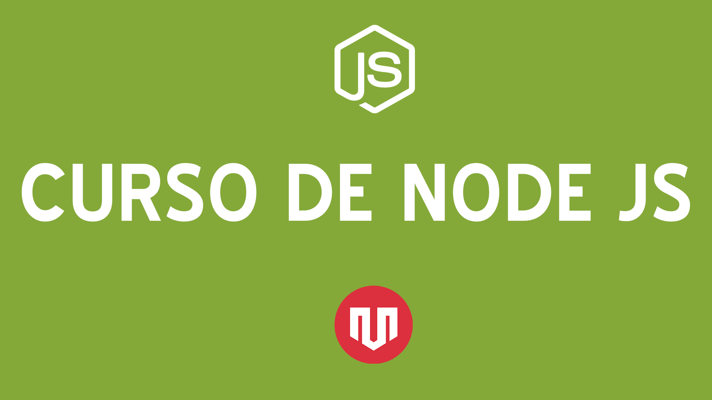

# Curso de Node JS - By Vida MRR 👨🏻‍💻

Bienvenidos al curso de Node JS para principiantes de Vida MRR. En este curso aprenderás las habilidades necesarias para dominar Node JS y crear aplicaciones bajo esta plataforma.

En el curso vamos a ver algunos temas como los siguientes:

  - Primeros pasos con el lenguaje
  - Uso de módulos para extender funcionalidad de Node JS
  - Creación de servidores web
  - Uso de Express como framework para Node

➡️ Accede al [curso completo de Node JS en Vida MRR](http://www.vidamrr.com)

